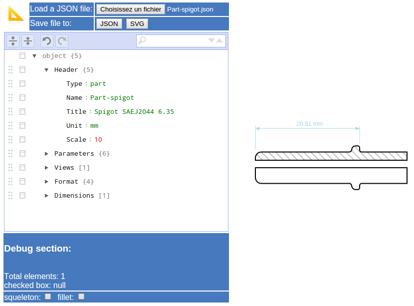

# JScad2d

Javascript Library for CAD 2D drawing from json file. A JSON file includes all data needed to draw paramateric 2D shape as vector image. Export in JSON file or in SVG file.

[Test here the live demo](https://benardt.github.io/indexjscad2d.htm)

## Screenshots



## Description

Draw parts and assemble them in an assembly drawing. Parts and Assy drawing are built from json file. A special editor allows live drawing.

NOTE: assembly functionality not yet coded!

## Features

* Full parametric modeling
* Draw any shape (print squeleton for debug)
* Make fillet
* Fill shape with hatch
* Draw dimensions
* Apply transformation
  * Rotate
* Import from local drive or server
* Export on local drive with format:
  * JSON (native format)
  * SVG

## Usage

### API Reference

* JScad2d.loadFileAsText()
* JScad2d.readfile(url)
* JScad2d.zoomandpan(value)
  * value for zoom: _zoomIn_ or _zoomOut_ or _reset_
  * value for pan: _left_ or _right_ or _up_ or _down_
* JScad2d.displayClassToggle('dim' or 'ptsfillet' or 'squeleton')
* JScad2d.drawOrigin()
* JScad2d.doDebug()

### Code example

Add JS libraries and style sheets links inside HEAD tag:
```html
<head>
    <link rel="stylesheet" type="text/css" href="./jsoneditor/jsoneditor.min.css">
    <link rel="stylesheet" type="text/css" href="./jscad2d/JScad2d.css">
    <script src="./svg-pan-zoom/svg-pan-zoom.js"></script>
    <script src="./jsoneditor/jsoneditor.min.js"></script>
    <script src="./jscad2d/JScad2d.js"></script>
</head>
```

### JSON file description for PART

* Header {}
  * Type: part
  * Name
  * Title
  * Unit
* Parameters{}
* Views[]
  * [] {}
    * Header {}
      * Name
      * Origine {}
        * x
	    * y
      * Hatch {}
    * Lines []
      * [] {}
	* Stroke
	* Start {}
	* End {}
    * Shapes []
      * [] {}
        * Fill
	* Points []
	  * [] {}
	    * x
	    * y
	    * length
	    * angle
	    * r
* Format{}
* Dimensions[]

### JSON file description for ASSY

* Header {}
 * Type: assy
 * Name
 * Title
 * Page size
 * Unit
* Parameters[]
* Parts[]
  * Name
  * View
  * Origine{}
  * Transformation{}
* Dimensions[]
  
## Dependencies

* jsoneditor (https://github.com/josdejong/jsoneditor/)
* svg-pan-zoom (https://github.com/ariutta/svg-pan-zoom)


